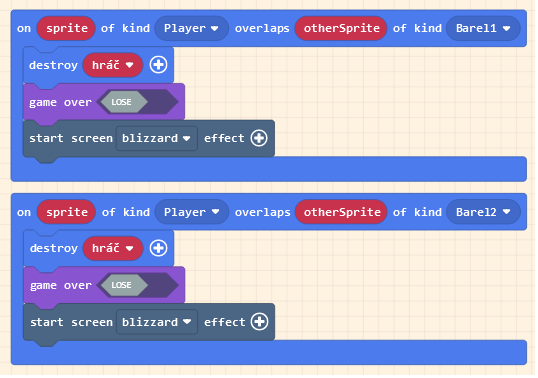

# České tutoriály pro Retro Arcade for Education
Kódy jsou psány tak jak jsou v blokové verzi

# Donkey Kong
Původní [hra](https://en.wikipedia.org/wiki/Donkey_Kong) je z roku 1981 a byla vytvořená developerem [Shigeru Miyamotem](https://cs.wikipedia.org/wiki/%C5%A0igeru_Mijamoto). Hru momentálně vlastní společnost [Nintendo](https://cs.wikipedia.org/wiki/Nintendo).

## Krok 1: Vytvoření hráče
### on start:
- set mySprite to sprite ... of kind Player (přejmenujte mySprite na hráč nebo jak si chcete hráče pojmenovat, abychom v postavách neměli nepořádek, pozor na pojmenování player/Player, programu se to nebude líbit; vytvoření hráče)
- set hráč to position x: y: (doplňte si posle sebe; přesune hráče na startovní pozici)
- move hráč with buttons vx:80 vy:0 (vx klidně i 100, ale vy vždy 0; vx znamená velocity x neboli rychlost posunu na horizontální ose, vy je velocity y neboli rychlost posunu na vertikální ose)
- set hráč ay to 500 (otestujte si, možná změna; ay znamená vertikální zrychlení, jak moc zrychlí hráč)
- camera follow sprite hráč (hráč bude středem pozornosti, hýbe se s ním kamera)

### Blok kódu po kroku 1:


## Krok 2: Vytvoření světa
### on start:
- set background image to nothing (prázdná obrazovka, můžete si vybrat i obrázek)
- set background color to black (vyberte si vlastní barvu, originální donkey kong měl černé pozadí, pokud jste si vybrali jako pozadí obrázek, je tento krok zbytečný)
- set tilemap to ... (vytvořte si vlastní level, budete potřebovat blok platformy a blok žebříku, platformy musí být nastaveny jako zdi, žebřík ne, platformy by měli být nakloněné, aby po nich později mohly padat sudy, také je dobré změnit si velikost tilemapy, aby byl level větší)

### Blok kódu po kroku 2:


## Krok 3: Pohyb hráče
### on left button pressed:
- set hráč image to ... (postava kouká doleva; možné animace)
### on right button pressed:
- set hráč image to ... (postava kouká doprava; možné animace)
### on down buton pressed:
- set hráč image to ... (postava se kouká dopředu a krčí se)
### on up button pressed:
```
if (is hráč hitting wall bottom)
{
	set hráč vy to -150; (nastaví vertikální rychlost na -150 abychom mohli skočit)
	if (is right button pressed)
	{
		set hráč image to ...; (skok vpravo, možná animace)
	}
	else if (is left button pressed)
	{
		set hráč image to ...; (skok vlevo, možná animace)
	}
}
```

### Bloky kódu po kroku 3:


## Krok 4: Žebřík
### on sprite of kind Player overlaps (obrázek žebříku) at location:
```
if (is up button pressed then)
{
	set hráč velocity to vx:0 vy:-50; (díky záporné vertikální rychlosti pojede náš hráč nahoru po žebříku)
	set hráč image to ...; (obrázek otočení zády, možná animace, pozor na šířku postavičky, musí být užší než mezera mezi dvěma platformami)
}
```

### Blok kódu po kroku 4:


## Krok 5: Kong a Peach
### on start:
- set mySprite to sprite ... of kind Enemy (přejmenujte mySprite na kong/Kong či jinak, abychom v tom neměli nepořádek; vytvoření protivníka jménem Donkey Kong)
- set kong position to x: y: (bude na vrchním patře, pozici si určete sami podle sebe)
- set mySprite to sprite ... of kind Peach (přejmenujte mySprite na peach/Peach či jinak, abychom neměli nepořádek. Musíme si vytvořit nový typ spritu Peach; vytvoření postavy, kterou zachraňujeme)
- set peach position to x: y: (souřadnice si upravte podle vlastní mapy)
### on sprite of kind Player overlaps otherSprite of kind Peach
- start screen confetti effect
- game over win (vyhraná hra pokud se hráč dotkne peach)
### on sprite of kind Player overlaps otherSprite of kind Enemy
- destroy hráč
- start screen blizzard effect  
- game over lose (prohraná hra pokud se hráč dotkne konga)

### Bloky kódu po kroku 5:


## Krok 6: Vytvoření a fyzika barelů
### on game update every 2000 ms
- set mySprite to sprite ... of kind Barel1 (přejmenujte si mySprite na barel1 a vytvořte si nový typ spritu Barel1)
- place barel1 on top of random ... (do svojí tile mapy si přidejte černý (podle barvy vašeho pozadí) předmět např tečku na místa ze kterých chcete vysílat barely směrem doleva)
- set barel1 velocity to vx:-50 vy:0 (barel pojede do leva)
- set barel1 ay (acceleration y) to 500 (barel bude padat pokud se nebude dotýkat platformy)
### on game update every 2000 ms
- set mySprite to sprite ... of kind Barel2 (přejmenujte si mySprite na barel2 a vytvořte si nový typ spritu Barel2)
- place barel2 on top of random ... (do svojí tile mapy si přidejte jiný černý (podle barvy vašeho pozadí) předmět např tečku na místa ze kterých chcete vysílat barely směrem doprava)
- set barel2 velocity to vx:50 vy:0 (barel pojede do prava)
- set barel2 ay (acceleration y) to 500 (barel bude padat pokud se nebude dotýkat platformy)
### on sprite of kind Barel1 overlaps (obrázek žebříku) at location
- set sprite velocity to vx:-50 vy:0 (barel pojede vlevo)
- set prite ay (acceleration y) to 500 (barel bude padat po žebříku)
### on sprite of kind Barel2 overlaps (obrázek žebříku) at location
- set sprite velocity to vx:50 vy:0 (barel pojede vpravo)
- set prite ay (acceleration y) to 500 (barel bude padat po žebříku)

### Bloky kódu po kroku 6:


## Krok 7: Ničení barelů a hráče
### on sprite of kind Player overlaps otherSprite of kind Barel1
- destroy hráč (pokud se hráč dotkne barelu tak hra končí)
- game over lose
- start screen blizzard effect
### on sprite of kind Player overlaps otherSprite of kind Barel2
- destroy hráč (pokud se hráč dotkne barelu tak hra končí)
- game over lose
- start screen blizzard effect
### on sprite of kind Barel1 overlaps (třetí černý předmět) at location
(černý předmět dejte na tilemapě na místa kde se hromadí barely jedoucí vlevo)
- destroy sprite
### on sprite of kind Barel2 overlaps (čtvrtý černý předmět) at location
(černý předmět dejte na tilemapě na místa kde se hromadí barely jedoucí vpravo)
- destroy sprite

### Bloky kódu po kroku 7:



## Finální kód:
Mojí hru najdete [tady](https://arcade.makecode.com/S91315-70078-54716-48617)


***


# Flappy bird
## Krok 1: Vytvoření hráče a pozadí
### on start:
- set background color to ...
- set score to 0
- start screen ... effect
- set Hrac to sprite ... of kind Player
- set Hrac ay(acceleration y) to 300

### on any button pressed
- set Hrac vy (velocity y) to -100
- Hrac start ... effect

### Bloky kódu po kroku 1:


## Krok 2: Generace překážek
### on game update every 1500 ms
```
set Mezera to pick random 0 to 3
if (Mezera = 0) then
{
	set topImage to ... //1 špalek ze shora
	set bottomImage to ... //4 špalky ze zdola
}
else if (Mezera = 1) then
{
	set topImage to ... //2
	set bottomImage to ... //3
}
else if (Mezera = 2) then
{
	set topImage to ... //3
	set bottomImage to ... //2
}
else
{
	set topImage to ... //4
	set bottomImage to ... //1
}
```

### Blok kódu po kroku 2:


## Krok 3: Mezery u překážek
### on game update 1500ms (pod krok 2)
- set gapImage to create image width 3 height screen height
- fill gapImage with ...
- set gapSprite to sprite gapImage of kind Mezera
- set gapSprite auto destroy ON
- set gapSprite invisble ON
- set gapSprite left to screen width
- set gapSprite vx (velocity x) to -45
- set Stena to projectile topImage from side vx: -45 vy: 0
- set Stena top to 0
- set Stena to projectile bottomImage from side vx: -45 vy: 0
- set Stena bottom to screen height

### Blok kódu po kroku 3:


## Krok 4: Přičítání bodů
### on sprite of kind Player overlaps otherSprite of kind Mezera
```
if ((otherSprite.right - sprite.left) < 2) then
{
	change score by 1
}
```

### Blok kódu po kroku 4


## Krok 5: Prohra
### on sprite of kind Player overlaps otherSprite of kind Projectile
- game over LOSE

### on game update
```
if ((Hrac.bottom > 120) or (Hrac.top) < 0)
{
	game over LOSE
}
```

### Bloky kódu po kroku 5:


## Hotovo

## Krok 6: Animace
Rozklikněte sekci Extensions a v ní klikněte na Animation, do již existujících Advanced bloků Animation se nám přidá jestě víc bloků pro animaci.

### on start
- set anim to create animation of Walking with interval 25 ms
- add frame ... to anim
- add frame ... to anim
-  -||- (dokud nebudete mít všechny bloky, které chcete mít v animaci)
-  attach animation anim to sprite Hrac

### on game update
```
if (Hrac.vy > 0)
{
	activate animation Walking on Hrac
}
```

### on any button pressed
mezi set Hrac vy a Hrac start effect
- activate animation Walking on Hrac

### Bloky kódu po kroku 6:


